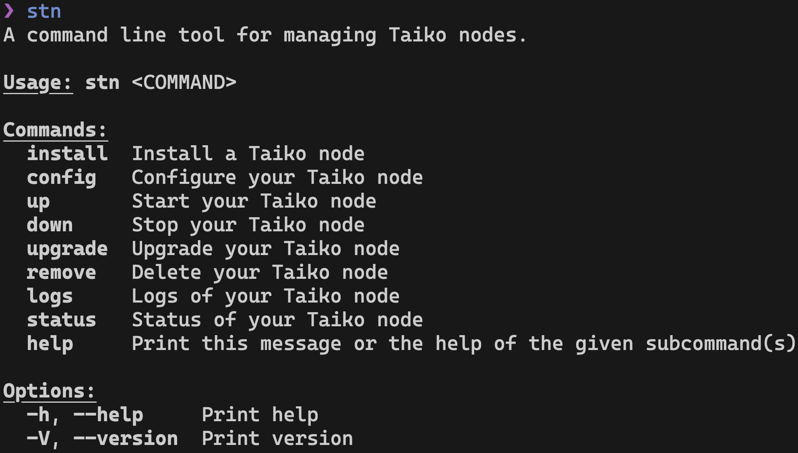

# stn

A command line tool for managing Taiko nodes.

> Screenshot of `v0.1.27`, but `stn` is getting updated all the time.

## Installation

Visit the [releases page](https://github.com/d1onys1us/stn/releases) for a simple one-line command to install `stn`.

## Quickstart

1. Install a Taiko node: `stn install`.
2. Configure your Taiko node: `stn config`.
3. Start your Taiko node: `stn up`.

## Usage

Execute `stn help` for the full list of commands.

## Contribute

If you have any feature requests or bug reports please [open an issue](https://github.com/d1onys1us/stn/issues/new)! ヽ(・∀・)ﾉ
