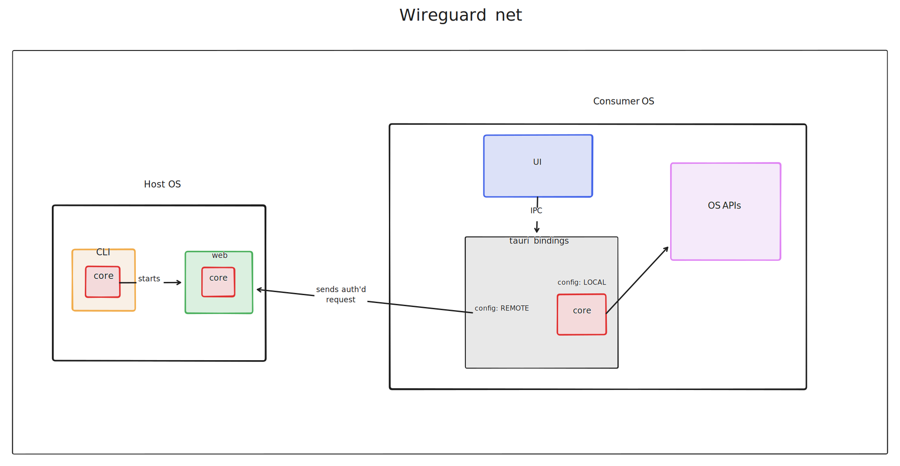

This document gives a high level architectural overview for Kittynode.

## Packages

| Package | Description |
| --- | --- |
| [kittynode-cli](https://github.com/kittynode/kittynode/tree/main/packages/cli) | A CLI frontend that binds to kittynode-core. |
| [kittynode-core](https://github.com/kittynode/kittynode/tree/main/packages/core) | Core library powering the Kittynode apps. |
| [kittynode-gui](https://github.com/kittynode/kittynode/tree/main/packages/gui) | A GUI frontend that binds to kittynode-core. |
| [kittynode-web](https://github.com/kittynode/kittynode/tree/main/packages/web) | A web server that binds to kittynode-core. |

## Technology used

- Core library written in Rust.
- Frontend written in Svelte.
- CLI is a cross-platform Rust binary.
- GUI is a cross-platform Tauri app.

## Development guide

See the [development guide](https://kittynode.io/development/development-guide) for more information on coding principles and how to contribute to the project.

## User facing apps

Kittynode has two user facing apps:

- A command line interface (CLI).
- A graphical user interface (GUI).

These user facing apps manage your Kittynode through the core library.

## Capabilities

There are several capabilities you can add to your Kittynode which augment the threat model. We default to minimizing the capabilities of the Kittynode, while giving enough features to get started.

Here are a few example capabilities related to remote access:

- **Read only (default)**: Kittynode is a read-only monitoring application.
- **Local only**: Kittynode can update local node infrastructure from the host machine.
- **Private onchain requests**: Kittynode can update local node infrastructure via listening to private requests submitted onchain.
- **Local HTTPS server**: Kittynode can update local node infrastructure via requests that come from the same Wireguard network (but a different machine, such as a phone); these requests are authenticated by a passkey or JWT token.

## A diagram

:::note
This diagram is not fully up to date.
:::

## Design

### Easy-to-use and secure

The workflow for Kittynode is designed to make it as easy as possible for the user to get started, while making the right recommendations for them along their operator journey. For example, a user may download Kittynode and sync an Ethereum testnet node in just a few clicks to get their feet wet.

However, they may later decide to become an independent staker on Ethereum mainnet, which requires a lot more security checks. Kittynode will guide the user through the necessary steps to get there, while keeping the low initial barrier to entry.

### Modular core library

Kittynode is architected as a backend library in Rust, providing several benefits:

- **Reusable core**: The desktop application is a consumer of this core library, with Tauri used to bind commands to the library.
- **Cross-platform support**: Kittynode supports a cross-platform desktop and mobile application as a frontend, along with a CLI that reuses the same core library.
- **Safety and performance**: Rust was chosen for its safety, performance, and cross-platform compatibility, making Kittynode easy to run on macOS, Windows, and Linux.

### Direct container access

Kittynode doesn't use Docker CLI commands on the user's system directly. Instead it has its own module that directly interacts with the Docker engine with Bollard. This improves Kittynode's portability, security, and testability. It also allows for more flexible networking setups between Kittynode packages.

Kittynode also plans to support other environments (eg. Kubernetes) in the future.

## Features

### Package ecosystem

Kittynode supports a package ecosystem. Ethereum nodes are simply packages which are executed and managed by Kittynode. Developers can create their own packages easily with Kittynode's package API. Kittynode supports Docker images but also supports direct binary executables. Kittynode may also support other languages and executable scripts in the future.

The design goals of the package ecosystem are to ensure installs are:

- **Secure**: Packages are securely isolated from each other.
- **Consistent**: Packages behave the same on all systems.
- **Atomic**: Package installs and uninstalls are atomic, without polluting the system.

### System checker

The system checker is a utility within Kittynode that checks the system prerequisites for running a node, along with other system checks. A short list of some checks are:

- **System resources**: Checking the available storage, CPU, and RAM.
- **Network settings**: Checking the firewall and internet connectivity.
- **Security settings**: Checking file permissions and other system security settings.

The system checker is important in several areas of Kittynode. For example, when creating a validator key it is important to ensure WiFi is disabled, and file permissions are properly set on the key file.

### Remote access

Kittynode supports remote access. This means you can setup and monitor your node from a phone or desktop. This is currently done via a secure connection over Wireguard, which allows users to monitor their node from trusted devices. This also allows users to easily upgrade their nodes from anywhere, which is important for voting. There are plans to support another mechanism for remote management as well, which doesn't even require a direct connection.
